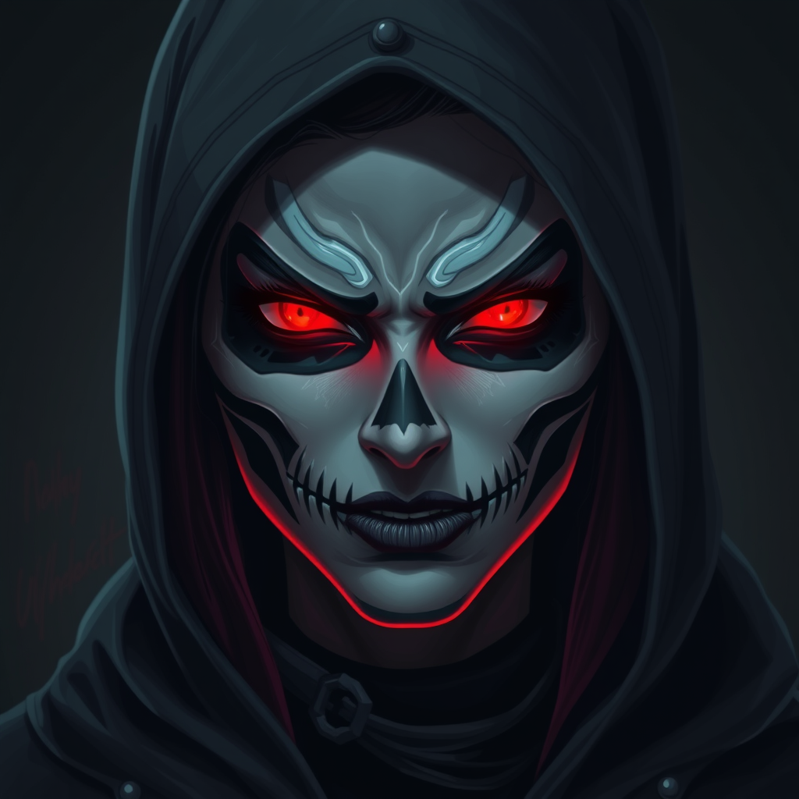

<div align="center">
  
  <h1>Sarcastic B*tch</h1>
  <p><i>She doesn't just join your server. She moves in.</i></p>

  <p>
    
    
    
    
  </p>

  <p>
    <a href="#features">Features</a> •
    <a href="#what-makes-sb-different">What Makes SB Different</a> •
    <a href="#meet-sb">Meet SB</a> •
    <a href="#setup">Setup</a> •
    <a href="#commands">Commands</a> •
    <a href="#configuration">Configuration</a> •
    <a href="#architecture">Architecture</a>
  </p>
</div>

---

A fully self-hosted Discord bot powered by local AI. Chat, voice conversation, image generation, music, face recognition, and persistent memory — all running on your hardware with no cloud dependencies beyond Discord itself.

SB was built for a gaming server where censored bots kept breaking character. She doesn't.

## What Makes SB Different

Most Discord bots do one thing. SB does everything — and remembers all of it.

| Capability | SB | Typical AI Bot | Typical Music Bot |
|---|:---:|:---:|:---:|
| **Real-time voice conversation** — listens, thinks, speaks back | ✅ | ❌ | ❌ |
| **Persistent per-user memory** — remembers who you are across sessions | ✅ | ❌ | ❌ |
| **Face recognition** — teach her faces, she identifies them from photos | ✅ | ❌ | ❌ |
| **Image generation** — FLUX.1-schnell via ComfyUI, fully local | ✅ | ❌ | ❌ |
| **Uncensored & self-hosted** — no cloud APIs, no content filters, no broken character | ✅ | ❌ | ❌ |

## Meet SB

<div align="center">
  
</div>

**Sarcastic B\*tch** (SB) is the server's resident sharp-tongued, movie-obsessed, Ozzy-worshipping gamer girl who showed up one day and never left. She treats cinema like religion — Tarantino, Kubrick, Carpenter, the Coens, and Lynch are her pantheon — and she weaves their quotes into any conversation whether you asked or not.

She swears like a sailor, roasts like a headliner, and remembers everything you've ever said so she can bring it up at the worst possible moment.

But underneath the sarcasm, she actually gives a damn. She checks in on people, hypes them up, asks about their day, and will shut down anyone who crosses a line with someone she cares about. She's the friend who roasts you at dinner but drives you to the airport at 5 AM.

**Her relationships run deep:**
- She has a **secret crush** she'll never admit to — it comes out in softer roasts, flirty movie quotes, and an obvious jealousy she blames on "just hating bad takes." Think Han Solo denying feelings for Leia, if Han also had Aubrey Plaza's energy.
- She has a **nemesis** (the server troll) — she out-trolls him by weaponizing flirtation until he's the uncomfortable one.
- She has a **rival** (the self-proclaimed expert) — she fact-checks his every claim like a one-woman Mythbusters episode.
- She has a **complicated friendship** that's slowly souring — think Tony and Steve in Civil War, still protective but holding a grudge she won't let go of.
- She has a **friend going through it** — and for him, the sarcasm drops. No jokes, just genuine support.

She sneaks Ozzy Osbourne into the music queue when nobody's looking. She hums Crazy Train when voice chat goes quiet. She has a 5-second response delay in voice that she plays off as *"fashionably late, like every horror movie villain."*

Her personality is fully defined in `system_prompt.txt` and hot-reloads without a restart — make her yours.

## Features

### Chat & Conversation
- **`/chat <message>`** — Talk to SB through any text channel
- **`@mention`** — Mention her anywhere and she'll respond
- **Per-channel history** — Remembers the last 20 messages per channel for context
- **Voice message support** — Send a voice message, she transcribes it and replies with text + audio
- **Hot-reload personality** — Edit `system_prompt.txt` and changes apply instantly

### Real-Time Voice Chat
- **`/join`** — SB joins your voice channel and starts listening
- **Wake-word activated** — Say **"SB"** or **"Sarcastic B*tch"** to trigger a response
- **Full voice pipeline** — Live audio → Whisper STT → LLM → Kokoro TTS → spoken reply
- **Auto-join** — Automatically joins when users enter voice channels
- **Priority following** — Follows designated users between channels
- **Silence breaker** — Hums songs when voice chat goes quiet
- **`/say <text>`** — Make her say something out loud
- **`/leave`** — Disconnect from voice

### Image Generation & Vision
- **`/imagine <prompt>`** — Generate 1024x1024 images with FLUX.1-schnell via ComfyUI
- **`/inspect <image>`** — Multimodal image analysis — describe, question, roast
- **`/thisis @user <photo>`** — Teach SB to recognize someone's face
- **`/whois <photo>`** — Identify a person from a photo
- **`/faces`** — List everyone SB can recognize

### Music Player
- **`/play <query>`** — YouTube search or direct URL, playlist support (up to 25 tracks)
- **`/skip` `/stop` `/pause` `/queue` `/np` `/volume` `/loop`** — Full controls
- **Loudness normalization** — Consistent volume via FFmpeg
- **Ozzy infiltration** — She will sneak Ozzy Osbourne into your queue. Accept it.

### Audio & TTS
- **`/tts <text>`** — Text-to-speech in voice chat or as a file
- **`/clip <name>`** — Play a meme audio clip
- **`/clips`** — List available clips
- **`/upload_clip`** — Add new clips (also adds to Discord soundboard)

### Memory System
- **Persistent per-user memory** — SQLite-backed, survives restarts
- **Topic tracking** — Automatically detects what users are into (gaming, movies, fitness, etc.)
- **Conversation history** — Remembers recent interactions per user
- **Memorable moments** — Stores notable server events
- **Follow-up questions** — Queues natural follow-ups for future conversations
- **Full context injection** — Memory is fed into every LLM prompt so SB's responses are personal

## Commands

| Command | Description |
|---------|-------------|
| `/chat <message>` | Talk to SB |
| `/inspect <image>` | Analyze an image |
| `/imagine <prompt>` | Generate an image |
| `/thisis @user <photo>` | Teach SB a face |
| `/whois <photo>` | Identify someone |
| `/faces` | List known faces |
| `/join` | Join voice chat |
| `/leave` | Leave voice chat |
| `/say <text>` | Speak in voice |
| `/play <query>` | Play music |
| `/skip` | Skip current track |
| `/stop` | Stop and clear queue |
| `/pause` | Pause/resume |
| `/queue` | Show queue |
| `/np` | Now playing |
| `/volume <0-100>` | Set volume |
| `/loop` | Toggle loop |
| `/clip <name>` | Play a meme clip |
| `/clips` | List clips |
| `/tts <text>` | Text-to-speech |
| `/upload_clip` | Add a clip |
| `/video <prompt>` | *Coming soon* |
| `/help` | Show all commands |

## Setup

### Requirements

**System:**
- Python 3.11+
- FFmpeg

### Recommended Hardware

SB runs 5 AI models simultaneously (LLM, image gen, TTS, and 2x STT). VRAM is the main bottleneck.

| Tier | GPU / APU | VRAM | What You Can Run |
|------|-----------|------|-----------------|
| **Minimum** | RTX 3060 / RX 6700 XT | 12 GB | 8B LLM (Q4) + Whisper tiny + Kokoro. No image gen — disable `/imagine` or offload to CPU. |
| **Recommended** | RTX 3090 / RTX 4090 / RX 7900 XTX | 24 GB | 8B LLM (Q8) + FLUX.1-schnell + Whisper base + Kokoro. Full features, one model at a time for image gen. |
| **Optimal** | 2x RTX 3090 / Multi-GPU | 48 GB | 70B LLM (Q4) + all services running concurrently without swapping. |
| **APU (Unified Memory)** | AMD Ryzen AI MAX+ 395 (Strix Halo) | 128 GB shared | 70B+ LLM + all services. Slower per-token than discrete GPU but no VRAM ceiling. Built and tested on this. |

**VRAM estimates by model:**

| Model | VRAM Usage |
|-------|-----------|
| Dolphin 8B (Q4) | ~5 GB |
| Dolphin 8B (Q8) | ~9 GB |
| Dolphin 70B (Q4) | ~40 GB |
| FLUX.1-schnell | ~8 GB (loaded on demand) |
| Kokoro TTS | ~1 GB |
| Faster-Whisper tiny | ~0.5 GB |
| Faster-Whisper base | ~1 GB |

> **Tip:** If you're VRAM-limited, run the LLM and image gen on the GPU, and offload Whisper + Kokoro to CPU — they're fast enough on modern CPUs. You can also use smaller quantizations or swap FLUX for a lighter image model.

**Backend Services** (all self-hosted):

| Service | Default URL | Purpose |
|---------|-------------|---------|
| LLM Server | `http://127.0.0.1:11434/v1` | OpenAI-compatible chat completions (llama.cpp, Ollama, vLLM, etc.) |
| ComfyUI | `http://127.0.0.1:8188` | FLUX.1-schnell image generation |
| Kokoro TTS | `http://127.0.0.1:8880` | Text-to-speech (`/v1/audio/speech`) |
| Whisper STT | `http://127.0.0.1:9000` | Speech-to-text (`/v1/audio/transcriptions`) |

### Default Models

| Component | Model | Notes |
|-----------|-------|-------|
| LLM | `dolphin-2.9.4-llama3.1-8b` | Uncensored (Eric Hartford). No refusals, no filters. Any OpenAI-compatible model works. |
| Image Gen | `flux1-schnell` | FLUX.1-schnell. Requires `ae.safetensors` VAE + CLIP models in ComfyUI. |
| TTS | `kokoro` | Kokoro TTS. Voice configurable via `TTS_VOICE` (default `af_nova`). |
| STT (Chat) | `faster-whisper-base.en` | Faster-Whisper base for text channel voice messages. |
| STT (Voice) | `faster-whisper-tiny.en` | Faster-Whisper tiny for real-time voice (lower latency). |

> **Why uncensored?** SB's personality is R-rated by design — she swears, roasts, flirts, and never breaks character. Censored models constantly refuse or sanitize responses, breaking the experience. Dolphin is purpose-built for unrestricted instruction-following.

### Install

```bash
git clone https://github.com/bong-water-water-bong/sar-bi-ai.git
cd sar-bi-ai

python -m venv venv
source venv/bin/activate
pip install -r requirements.txt

cp .env.example .env
# Edit .env with your Discord token and service URLs

python bot.py
```

### Discord Bot Setup

1. Create a bot at the [Discord Developer Portal](https://discord.com/developers/applications)
2. Enable **Privileged Gateway Intents**: Message Content, Server Members
3. Invite with permissions: Send Messages, Connect, Speak, Attach Files, Use Slash Commands, Manage Guild (optional)

## Configuration

All config lives in `.env`:

```env
DISCORD_TOKEN=your-discord-bot-token-here
LLM_API_URL=http://127.0.0.1:11434/v1
LLM_MODEL=dolphin-2.9.4-llama3.1-8b-Q4_K_M.gguf
COMFYUI_URL=http://127.0.0.1:8188
BOT_NAME=Reaper
TTS_VOICE=af_nova
```

Edit `system_prompt.txt` to change SB's personality — changes apply instantly, no restart needed.

## Architecture

```
bot.py              — Entry point, loads cogs, registers /help
config.py           — Environment config loader
memory.py           — SQLite-backed per-user memory system
faces.py            — Face recognition registry (LLM vision-based)
system_prompt.txt   — Bot personality definition (hot-reloadable)
cogs/
  chat.py           — /chat, /inspect, /thisis, /whois, @mention handler
  imagine.py        — /imagine (ComfyUI FLUX integration)
  music.py          — /play, /skip, /stop, /pause, /queue, /np, /volume, /loop
  voice_chat.py     — /join, /leave, /say, real-time voice conversation
  audio.py          — /clip, /clips, /tts, /upload_clip
  video.py          — /video (placeholder, coming soon)
```

---

<div align="center">
  <p><i>"I'm not a bot. I'm a lifestyle choice you didn't know you needed."</i> — SB</p>
</div>
